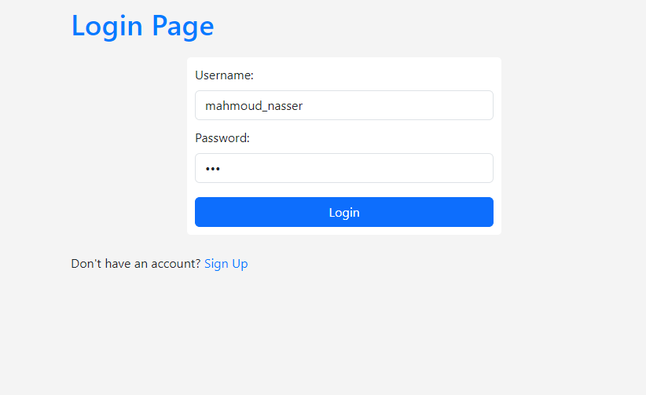
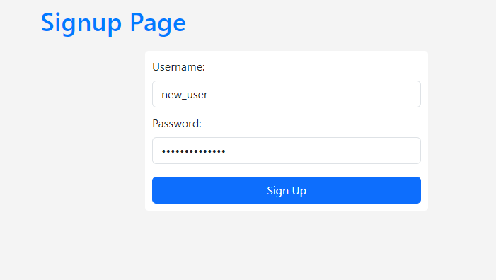
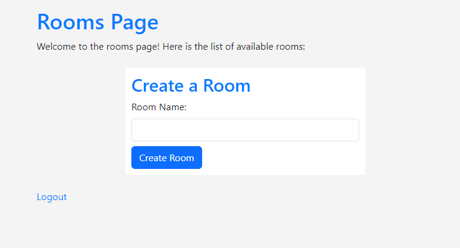
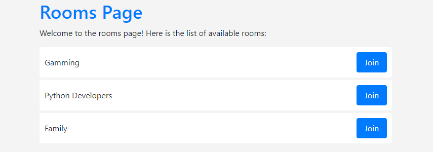
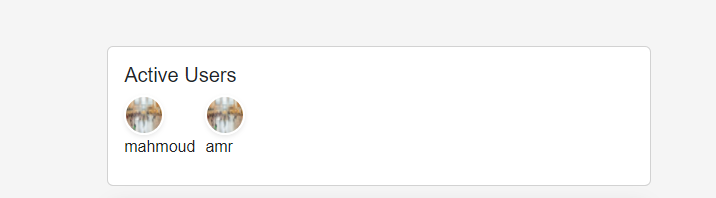
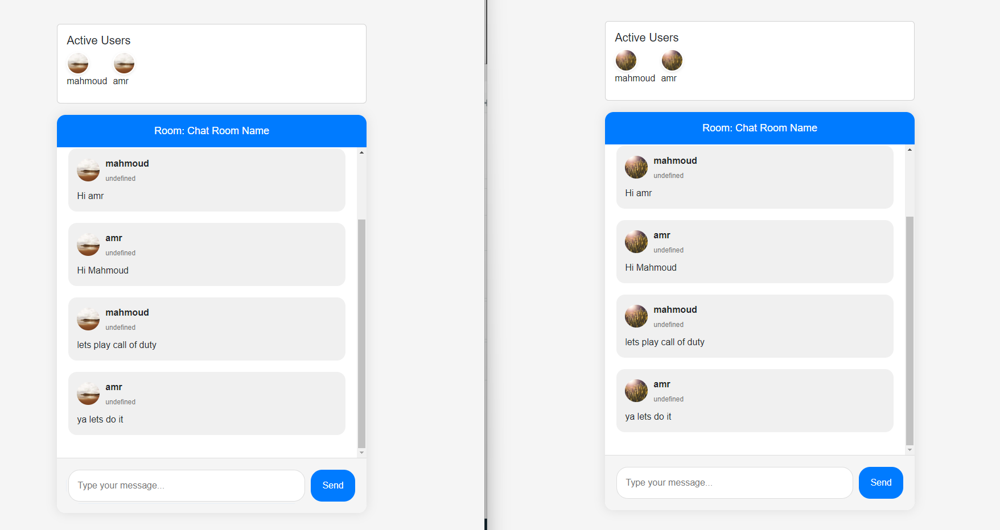
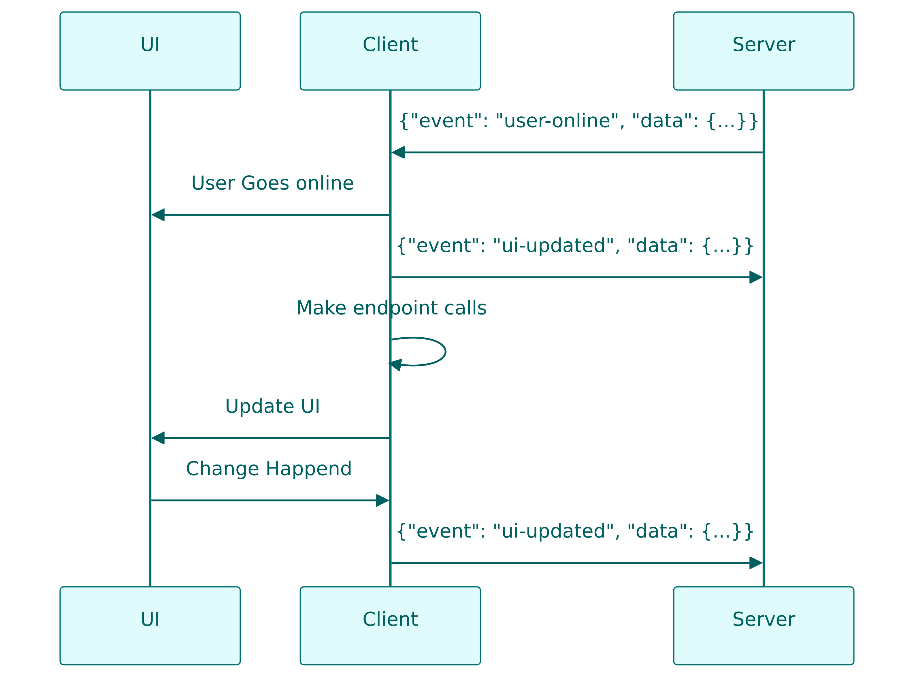
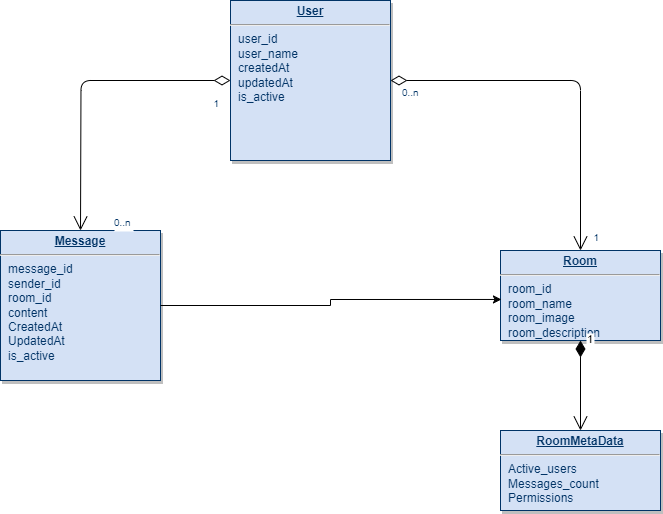

# My Little Chat

This is a simple chat application that allows users to chat with each other in real time. It is built using python, websockets, and MongoDB.


# Quick Setup (Docker-Compose) 🚀
### 1. Install Docker and Docker-Compose
```bash
sudo apt install docker.io
sudo apt install docker-compose
```
### 2. Run Docker-Compose
```bash
docker-compose up
```

# Quick Setup (Manual) 🚀
### 1. Install Dependencies
```bash
pip install -r requirements.txt
```
### 2. Run Http Server
```bash
python http_server.py
```

### 3. Run Websocket Server
```bash
python websocket_server.py
```

### 4. Configure the values in .env file


# Features 😊
- [X] handle all the data via nosql database (MongoDB)
- [X] leverage the power of docker and docker-compose
- [X] custom http server to handle concurrent requests
- [X] custom websocket server to handle concurrent requests
- [X] unit tests
- [X] serve static files
- [x] User Authentication
- [x] User Registration
- [x] User Login
- [x] User could create a room
- [x] User could join a room
- [X] realtime room chat
- [X] realtime typing effect
- [X] realtime online users


# Screen Shots 📷

### 1. Login Page


### 2. Register Page


### 3. Create Room


### 4. Rooms List


### 5. Active Users


### 6. Chatting


# WorkFlow 🚀


# Database Schema 📚



## 1.Websocket Server (websocket_server.py)


This Python script implements a WebSocket chat server with user authentication, message broadcasting, and MongoDB integration.

### Dependencies

- `asyncio`: Asynchronous I/O for handling multiple WebSocket connections concurrently.
- `json`: For encoding and decoding JSON data.
- `websockets`: Library for WebSocket communication.
- `os`: For environment variable and directory path handling.
- `dotenv`: Loads environment variables from a `.env` file.
- `models.Message`: Represents a chat message and is used for creating and storing messages in MongoDB.
- `mongodb_operations.MongoDBOperations`: Handles MongoDB operations for user authentication and message storage.

### Configuration

#### WebSocket Server Configuration

- `HOST`: WebSocket server host address.
- `PORT`: WebSocket server port.
- `STATIC_DIR`: Directory path for static files.

#### MongoDB Configuration

- `MONGO_URI`: MongoDB connection URI.
- `DB_NAME`: MongoDB database name.

### Usage

1. Ensure all required dependencies are installed (`asyncio`, `json`, `websockets`, `os`, `dotenv`, `models`, `mongodb_operations`).
2. Create a `.env` file with the necessary configuration variables.
3. Run the script (`python script_name.py`).

The server will start listening for WebSocket connections, handle authentication, and broadcast messages to connected users in specific rooms. The server also integrates with MongoDB to store chat messages.

### Script Overview

### `handle_connection(websocket, path)`

Handles a WebSocket connection and manages user authentication, message broadcasting, and database storage.

- **Parameters:**
  - `websocket`: WebSocket connection object.
  - `path`: WebSocket connection path.

- **Raises:**
  - `websockets.exceptions.ConnectionClosedError`: If the connection is closed by the client.

### `broadcast(message, connected_users=None)`

Broadcasts a message to all connected users in a specific room.

- **Parameters:**
  - `message`: Message to be broadcasted.
  - `connected_users`: List of connected users in a room.

### `main()`

Main function to run the WebSocket server.

This function creates and serves the WebSocket server, handling incoming connections.

- **Usage:**
  - `asyncio.run(main())`

## Example

```bash
python script_name.py
```


## 2. MongoDB Operations (mongodb_operations.py)


### 1. Password Hashing
- Uses the `hashlib` library to hash passwords using SHA-256 with a predefined salt.

### 2. MongoDB Operations Class (`MongoDBOperations`)
- Manages interactions with a MongoDB database.
- Provides methods for creating, authenticating, and retrieving users, rooms, and messages.
- Handles basic error logging for user creation.

### 3. Run Function
- Demonstrates the usage of the `MongoDBOperations` class.
- Creates a user, authenticates the user, creates a room, and creates a message.
- Retrieves user, room, and message information from the database.

### 4. Database Initialization
- Instantiates the `MongoDBOperations` class with MongoDB URI and database name.

### 5. Run the Application
- Calls the `run` function to showcase the functionality.

**Note:** Ensure a local MongoDB server is running. The code contains basic error handling for user creation and prints error messages to the console.
